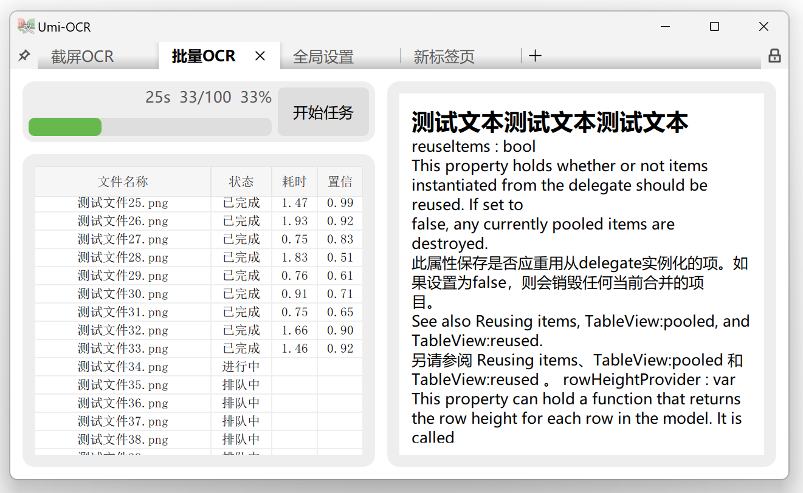
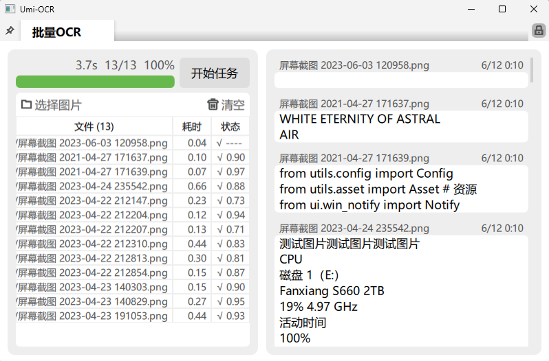

# Umi-OCR v2 施工现场

这里是记录 [Umi-OCR](https://github.com/hiroi-sora/Umi-OCR) 全新重构版本v2.0的仓库。

本仓库仅作前中期开发过程记录使用。

项目细节请见：[V2.0版本 | 前景展望 | 意见收集 | 功能投票](https://github.com/hiroi-sora/Umi-OCR/issues/146)

## 体验预览版本：

[Releases](https://github.com/hiroi-sora/Umi-OCR_v2/releases)

## 预计效果：

## 当前进度：

- [x] 标签页框架。
- [x] OCR API控制器。
- [x] OCR 任务控制器。
- [x] 主题管理器，支持切换浅色/深色主题主题。
- [x] 实现 **批量OCR**。
- [x] 实现 **截图OCR**。
- [x] 快捷键机制。
- [x] 系统托盘菜单。
- [x] 文本块后处理（排版优化）。
- [x] 引擎内存清理。
- [ ] 命令行模式。
- [ ] 忽略区域。
- [ ] 截图联动/截图翻译。

## 构建项目：

[项目开发指南](docs/项目开发指南.md)